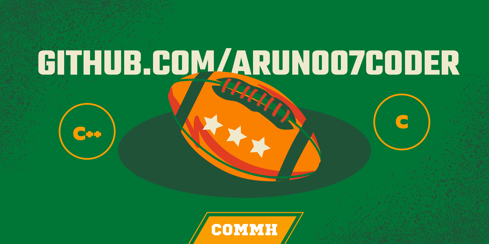

<!--Intro Text-->

## 

Hello, i am Arun Krishna. Known as [Arun007Coder](https://github.com/Arun007coder/Arun007coder) in github. I am currently working on SectorOS, a small OS written in C++. I like to make Operating system, automated scripts, etc... Here is [website](https://arun007coder.netlify.app/)!

I like to make programs in :

1. Intel x86 assembly
2. C++
3. Shell script
4. C
5. C#
6. Python
7. java
8. JavaScript

 
 

<!--Skill badges-->

  <code></code>
  <code></code>
  <code></code>
  <code></code>
  <code></code>
  <code></code>

  

<!--Content IDK bruh-->
<table>
  <tr>
    <td valign="center">
        ✹ I’m currently working on SectorOS RE2 🔭  
        ✦ I’m currently learning Python, Java, Javascript 🌱  
        ❂ Ask me about C 💬  
        ❃ How to reach me: arun007coder@gmail.com 📫  
        ✫  Pronouns: he/him 😄 
        ⚝  Fun fact: I'm just 15 ⚡ 
    </td>
    <td>
        
    </td>
  </tr>
</table>

<!--Github Stats-->

## 📊 My Github stats

  

     

  
 
# ⭐ Top repo
  

 

<!--Social badges-->

## ✌️ Me at the internet

